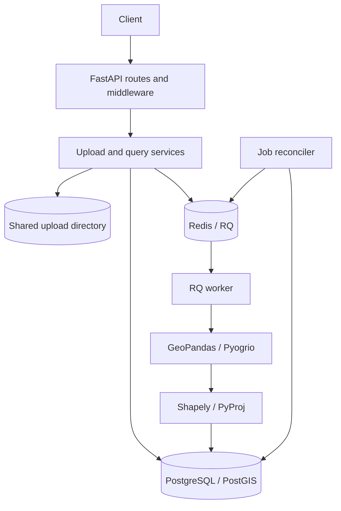

# Architecture

## Components

- **API layer** validates HTTP inputs, applies request context and production request guards, and
  maps domain errors to HTTP responses.
- **Services** own upload intake, geospatial file reading, measurement, and job state transitions.
- **Repositories** keep database query logic separate from routes and processing orchestration.
- **Worker** performs file parsing, feature extraction, reprojection, measurement, and batch inserts.
- **Reconciler** repairs queue-dispatch gaps and recovers stale jobs after worker termination.
- **PostgreSQL/PostGIS** stores metadata and results, with a GiST index for WGS 84 bounding-box
  queries. **Redis/RQ** transports processing tasks and stores production rate-limit counters.

## Upload and processing lifecycle

1. `POST /api/files/` checks the declared request size before multipart parsing, validates the file
   type and structural requirements, then copies it to a server-generated storage name.
2. The API writes an `UploadedFile` row and a `ProcessingJob` row in the same database transaction.
3. The queue receives the job ID. The API records the dispatch-attempt timestamp after the enqueue
   call succeeds and returns `202 Accepted` with both IDs.
4. The RQ worker claims a `PENDING` job by locking its database row. It sets both job and file to
   `PROCESSING` and increments the processing-attempt count before reading the upload.
5. The reader yields feature batches. Each feature is measured independently; the rows are inserted
   in batches inside the job's database transaction.
6. A successful transaction marks the job and file `COMPLETED` and records the feature count and
   source CRS. The stored upload is deleted only after the terminal state is committed.
7. A known invalid-file error or a non-database processing error rolls back the feature transaction,
   records a generic job-level failure, and removes the upload. A database persistence error leaves
   the source file and non-terminal job state available for recovery.

The feature table stores the source geometry as GeoJSON for API responses and a second geometry
column transformed to SRID 4326 for indexed `bbox` queries. That duplication is intentional: source
coordinates are returned as supplied, while spatial filtering has a consistent coordinate system.

## Dispatch and crash recovery

A database transaction and a Redis enqueue cannot be made atomic without an outbox or a similar
coordination mechanism. This application records the database job first, then enqueues it. If the
API process stops during that gap, the job has no dispatch-attempt timestamp and the reconciler
finds it for dispatch. Pending jobs whose last dispatch attempt is older than
`QUEUE_RETRY_INTERVAL_SECONDS` are also eligible for another dispatch.

A worker claims jobs under a row lock, so duplicate queue deliveries cannot concurrently claim the
same pending job. RQ queue IDs are unique per dispatch attempt; the durable database status is the
source of truth for whether work should run.

If a worker is terminated while processing, the job remains `PROCESSING` until its `started_at`
exceeds `JOB_TIMEOUT_SECONDS + JOB_RECOVERY_GRACE_SECONDS`. The reconciler then resets it to
`PENDING` and dispatches it again. Because feature inserts and the final state transition share a
transaction, an interrupted transaction does not leave a partial feature set. The reconciler clears
any rows for that file before retrying as an additional safeguard. Once `MAX_PROCESSING_ATTEMPTS`
have been claimed without reaching a terminal state, the reconciler marks the job failed and removes
the stored source file.

The reconciler is a separate process and should run as a single active instance unless its behavior
is reviewed for the intended deployment topology. Row locks with `SKIP LOCKED` avoid claiming the
same reconciliation rows when instances briefly overlap.

## Database model

- `uploaded_files`: safe display filename, type, status, file size, internal storage name, CRS,
  feature count, timestamps, and a sanitized error message.
- `processing_jobs`: one job per uploaded file, lifecycle timestamps, attempt count, and last
  dispatch-attempt timestamp.
- `features`: source geometry and properties, a WGS 84 spatial-index copy, feature status,
  measurement value/unit, projected CRS, and per-feature error where applicable.

Alembic migrations define the schema. Constraints limit allowed statuses, prevent negative feature
indices/measurements, and keep each `(file_id, feature_index)` unique. Query methods paginate in
feature order and defer geometry/properties when only measurements are needed.

## Measurement and CRS strategy

The service does not measure latitude/longitude coordinates directly. For each feature, it
transforms the centroid to WGS 84, chooses the UTM zone containing that position, transforms the
geometry into that projected CRS, and computes planar area or length there. Transformer instances
are cached per source/target pair for the life of a file measurer rather than recreated per feature.

This approach is practical for local or regional data, but is not a universal geodesic solution.
UTM does not cover latitudes beyond 80°S–84°N, and zone distortion matters for very large features,
features spanning zones, and geometries crossing the antimeridian. The service reports a per-feature
failure when it cannot select or apply the projection rather than silently measuring degrees.
Heights are ignored for planar area and length measurements.

## Operational constraints

- The API, worker, and reconciler require the same upload storage. The default Compose setup mounts
  a named volume in all three services; multi-host deployments need shared/object storage.
- Database migrations run before the API and workers start in Compose. Deployment environments
  should run migrations as a separately controlled release step.
- The production API key is a shared service credential. It is not user-level authorization and
  does not isolate files between clients.
- The rate limiter uses Redis fixed-window counters and fails closed if Redis is unavailable in
  production. The API is also expected to sit behind a reverse proxy that enforces the total request
  body limit, including requests without `Content-Length`.
- Offset pagination returns exact totals but can become expensive on deep pages. Keyset pagination
  and approximate counts are possible follow-up improvements for very large datasets.
